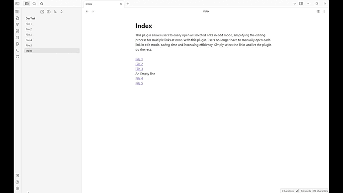

# Select Open 
This plugin allows users to easily open all selected links in edit mode, simplifying the editing process for multiple links at once. With this plugin, users no longer have to manually open each link in edit mode, saving time and increasing efficiency. Simply select the links and let the plugin do the rest.

## Features
Open all selected links in edit mode

## Demo
**Setup a hotkey and open selected links**\

## Usage
Go to the Obsian Settings and set the interval of tab rotation (second) \
*Setting > Community Plugins > Open Selected Links > Select Opening links method*

## Donating
If you find this custom plugin useful and would like to show your appreciation, please consider supporting me by buying me a coffee. Your donation would be greatly appreciated and would help me to continue creating helpful tools like this in the future. Thank you!

